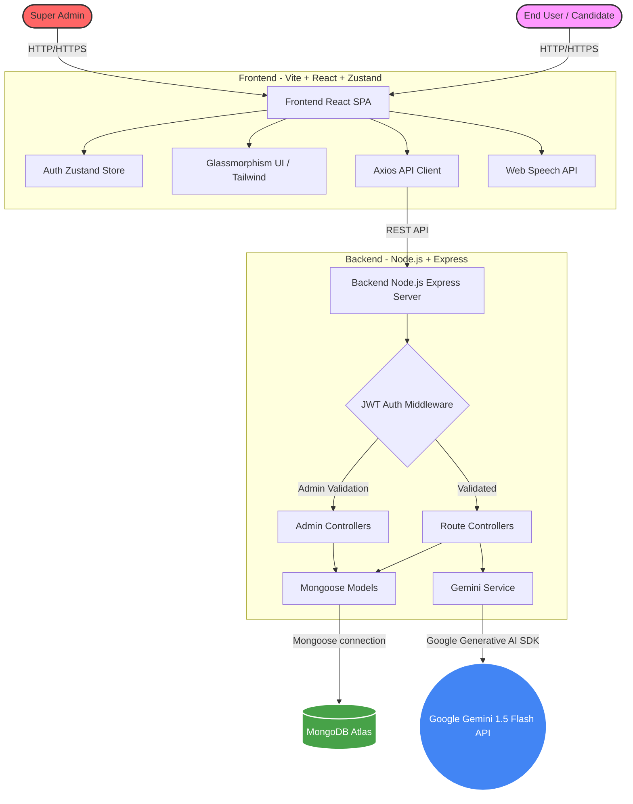
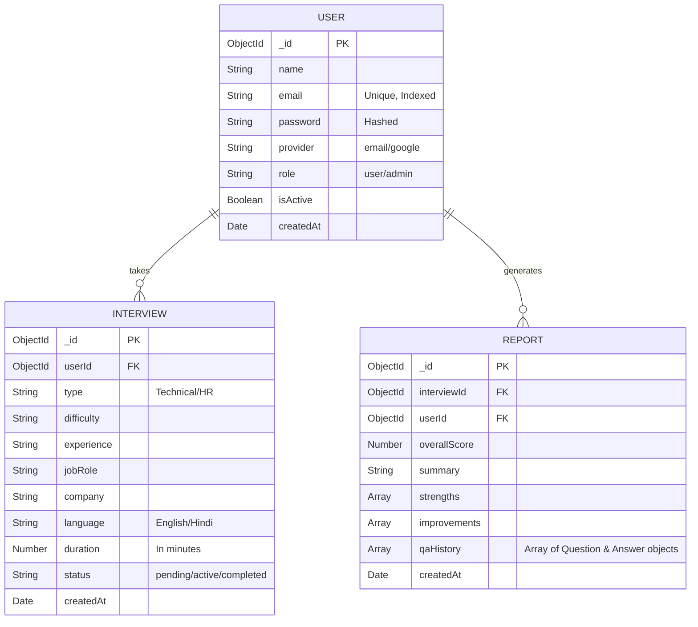
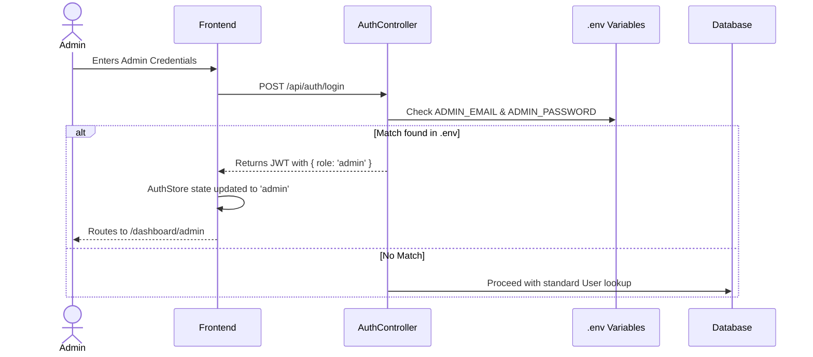

<div align="center">
  
  <h1>Interview Sarthi</h1>
  <p><strong>Your AI-Powered Career Coach for the Modern Tech Industry</strong></p>
  <p>
    
    
    
    
    
    
  </p>
  <p>
    <a href="https://interview-sarthi-one.vercel.app/" target="_blank">
      
    </a>
  </p>
</div>

<hr />

## 🌟 Introduction & Overview

**Interview Sarthi** is a comprehensive, AI-driven mock interview platform designed specifically for software engineering candidates, freshers, and professionals aiming to crack tech interviews. By leveraging the power of **Google's Gemini 1.5 Flash AI**, the platform dynamically generates tailored technical and behavioral questions based on the candidate's chosen role, experience level, and preferred language.

Unlike static quiz platforms, Interview Sarthi uses AI to evaluate answers in real-time, providing constructive feedback, syntax corrections, and optimized alternative answers. The ultimate goal is to bridge the gap between theoretical knowledge and practical interview performance.

---

## ✨ Key Features

- **Dynamic Mock Interviews**: Customized interviews across various roles (Frontend, Backend, Full Stack, DevOps).
- **Real-Time AI Evaluation**: Answers are scored instantly using natural language processing.
- **Multilingual Support**: Switch seamlessly between English and Hindi (Hinglish).
- **Comprehensive Feedback Reports**: Post-interview analysis highlighting strengths and areas for improvement.
- **Super Admin Dashboard**: A centralized control panel to monitor platform metrics and manage users.
- **AI Career Mentor**: A 24/7 AI chatbot for career advice, salary negotiation, and resume tips.
- **ATS Resume Builder**: Build and optimize resumes tailored for specific job descriptions.
- **Aptitude & Govt Exams**: Dedicated modules for practicing standard quantitative and reasoning questions.
- **Glassmorphism UI**: A stunning, premium aesthetic featuring dark/light mode and micro-animations.

---

## 🏛 System Architecture

The application follows a standard MERN stack architecture decoupled into a REST API backend and a Vite-React Single Page Application (SPA) frontend. 



### Architecture Highlights
1. **Frontend**: The React app uses `zustand` for lightweight state management (specifically for authentication). Routing is handled by `react-router-dom` using nested layouts (Auth, Dashboard, Main).
2. **Backend**: Express.js server utilizing layered architecture (Routes -> Controllers -> Services).
3. **AI Layer**: The `geminiService.js` constructs structured system prompts to force the LLM to output valid JSON representations of interview questions and feedback.

---

## 📊 Database Schema

The data layer is managed via MongoDB using Mongoose schemas. Below is an Entity-Relationship (ER) diagram representing the core data structures.



---

## 🔐 User Roles & Authorization Flow

The platform utilizes JWT (JSON Web Tokens) for authentication. There are two primary roles:
1. **Standard User**: Can create mock interviews, view personal history, access the AI mentor and build resumes.
2. **Super Admin**: A hardcoded credential bypass set in the environment variables.

### Super Admin Flow



---

## 📁 Frontend Application Structure

The frontend is structured to promote component reusability and clean layout management.

```text
frontend/
├── public/                # Static assets (images, SVGs)
├── src/
│   ├── components/        # Reusable UI components
│   │   ├── Navbar.jsx     # Public site navigation
│   │   ├── Footer.jsx     # Public site footer
│   │   ├── ThemeProvider.jsx # Dark/Light mode context
│   │   └── FeedbackModal.jsx # User feedback form
│   ├── layouts/           # Page wrappers determining structure
│   │   ├── AuthLayout.jsx # Wrapper for login/register
│   │   ├── DashboardLayout.jsx # Authenticated sidebar layout
│   │   └── MainLayout.jsx # Public pages layout
│   ├── pages/             # Route-level components
│   │   ├── auth/          # Login.jsx, Register.jsx
│   │   ├── dashboard/     # AdminPanel, AiMentor, Dashboard, HistoryReports, ResumeBuilder
│   │   ├── interview/     # InterviewRoom, SetupInterview, FeedbackReport
│   │   ├── profile/       # Profile.jsx
│   │   └── LandingPage.jsx, Courses.jsx, etc.
│   ├── store/             # Zustand global state
│   │   └── authStore.js   # Manages JWT, user object, and loading states
│   ├── lib/               # Utility functions
│   │   └── api.js         # Axios instance with interceptors
│   ├── i18n/              # Internationalization (Hindi/English context)
│   ├── App.jsx            # Main router configuration
│   ├── index.css          # Global Tailwind styles & CSS variables
│   └── main.jsx           # React DOM root entry
├── package.json
├── tailwind.config.js     # Tailwind theme and custom plugins
└── vite.config.js         # Vite bundler configuration
```

---

## ⚙️ Backend Application Structure

The backend follows the MVC (Model-View-Controller) pattern.

```text
backend/
├── src/
│   ├── config/            # Database and AI configuration
│   │   ├── db.js          # MongoDB connection script
│   │   └── gemini.js      # Google Generative AI SDK initialization
│   ├── controllers/       # Request handlers
│   │   ├── authController.js # Login, Register logic
│   │   ├── interviewController.js # Interview lifecycle management
│   │   └── userController.js # Profile updates
│   ├── middleware/        # Express middlewares
│   │   ├── auth.js        # JWT validation & Role checks (protect, adminOnly)
│   │   └── error.js       # Global error handler
│   ├── models/            # Mongoose schemas
│   │   ├── Interview.js
│   │   └── User.js
│   ├── prompts/           # Core AI prompt engineering
│   │   └── interviewPrompts.js # System instructions for Gemini
│   ├── routes/            # Express route definitions
│   │   ├── authRoutes.js
│   │   ├── interviewRoutes.js
│   │   └── userRoutes.js
│   ├── services/          # Business logic and external API calls
│   │   └── geminiService.js # Formatting AI requests and parsing JSON responses
│   └── app.js             # Express app setup and middleware mounting
├── .env                   # Environment variables (Git-ignored)
├── package.json
└── server.js              # Application entry point (Server listener)
```

---

## 📡 API Documentation

### Authentication Routes (`/api/auth`)
| Method | Endpoint | Description | Auth Required |
|---|---|---|---|
| POST | `/register` | Create a new standard user account | No |
| POST | `/login` | Authenticate user or Super Admin | No |

### Interview Routes (`/api/interviews`)
| Method | Endpoint | Description | Auth Required |
|---|---|---|---|
| POST | `/` | Initialize a new interview session | Yes (User) |
| POST | `/:id/continue` | Submit an answer and get the next question | Yes (User) |
| POST | `/:id/close` | End interview and generate feedback report | Yes (User) |

---

## 🧠 AI Integration Details (Gemini)

The platform currently leverages **Google Gemini 1.5 Flash**. 
*(Note: Initially designed for 2.0-flash, but downgraded to 1.5-flash to bypass stringent free-tier quota limits.)*

### How it Works
1. **System Instructions:** When an interview is initialized, `geminiService.js` creates a specific `systemInstruction` using data from the user (e.g., Job Role: Frontend Developer, Difficulty: Hard, Language: Hindi).
2. **JSON Enforcement:** The prompt strictly commands the LLM to output responses in raw JSON format without markdown blocks (` ```json `).
3. **Continuous Chat:** The `ChatSession` history is preserved during the interview to ensure the AI remembers the context of previous questions and answers.

```javascript
// Example System Prompt Configuration Structure
{
  model: 'gemini-1.5-flash',
  systemInstruction: `You are an expert technical interviewer at a top tech company. 
  You are conducting a Frontend Developer interview...
  ALWAYS respond in valid JSON format: { "question": "...", "concept": "..." }`
}
```

---

## 🛠 Local Development Setup

To run Interview Sarthi locally, you'll need Node.js (v16+) and a MongoDB Atlas account.

### 1. Clone the repository
```bash
git clone https://github.com/suryanshsingh07/interview-sarthi.git
cd interview-sarthi
```

### 2. Setup Backend
```bash
cd backend
npm install
# Create a .env file based on the environment variables section below
npm start
# Server will start on http://localhost:5000
```

### 3. Setup Frontend
```bash
# Open a new terminal
cd frontend
npm install
npm run dev
# Frontend will start on http://localhost:5173
```

---

## 🔐 Environment Variables

Create a `.env` file in the `backend/` directory:

```env
# Server Configuration
PORT=5000
NODE_ENV=development

# Database
MONGODB_URI=mongodb+srv://<username>:<password>@cluster0.myjhhzs.mongodb.net/interview-sarthi?retryWrites=true&w=majority

# JWT Authentication
JWT_SECRET=supersecretjwtkey123
JWT_EXPIRE=30d

# Super Admin Credentials
ADMIN_EMAIL=superadmin@interviewsarthi.com
ADMIN_PASSWORD=adminsecret123

# Google Gemini AI
GEMINI_API_KEY=your_google_ai_studio_api_key_here
```

---

## 🚀 Deployment Guide

### Backend Deployment (Render / Heroku)
1. Push your code to GitHub.
2. Connect your repository to Render.
3. Set the Root Directory to `backend`.
4. Build Command: `npm install`
5. Start Command: `npm start`
6. Add all Environment Variables in the Render dashboard.

### Frontend Deployment (Vercel / Netlify)
1. Connect your repository to Vercel.
2. Set the Root Directory to `frontend`.
3. Framework Preset: `Vite`
4. Build Command: `npm run build`
5. Output Directory: `dist`
6. Add `VITE_API_URL` environment variable pointing to your deployed backend (e.g., `https://api.interviewsarthi.com/api`).

---

## 🎨 Styling & Theming System

The application uses **TailwindCSS** combined with custom CSS variables (`frontend/src/index.css`) to create a premium **Glassmorphism** effect.

### Key CSS Variables
- `--background`, `--foreground`: Base colors for light/dark themes.
- `--gradient-hero`: A vibrant purple/blue gradient used for primary buttons and text emphasis.
- `--gradient-glass`: A semi-transparent white/dark gradient for glass panels.
- `.glass-card`: A custom utility class that applies backdrop blur, borders, and glass gradients automatically.

### Theme Toggling
Theme management is handled by `ThemeProvider.jsx`, which saves the user's preference (`light`, `dark`, or `system`) to `localStorage` and toggles the `.dark` class on the `<html>` element.

---

## 🐛 Troubleshooting & FAQs

**Q: I get a 429 Too Many Requests error when starting an interview.**
> A: You have hit the quota limit for the Gemini API. Ensure that the model defined in `backend/src/config/gemini.js` is set to `gemini-1.5-flash` (which has a higher free limit) instead of `gemini-2.0-flash`.

**Q: The dashboard sidebar pushes the whole page down on mobile.**
> A: This was a known issue that has been resolved by applying `.custom-scrollbar` and `flex-1 overflow-y-auto` to the navigation container in `DashboardLayout.jsx`.

**Q: How do I access the Super Admin panel?**
> A: Ensure `ADMIN_EMAIL` and `ADMIN_PASSWORD` are set in your backend `.env`. Log in via the standard login page using these exact credentials. You will automatically be routed to the Admin Dashboard.

---

## 🔮 Future Roadmap

- [ ] **WebRTC Video Integration**: Implement live video and audio recording during the interview.
- [ ] **Peer-to-Peer Mock Interviews**: Allow users to match with other candidates for live practice.
- [ ] **Resume Parsing**: Automatically extract skills from uploaded PDFs to tailor interview questions.
- [ ] **Code Execution Sandbox**: A built-in code editor (like Monaco) to compile and run algorithm answers in real-time.

---

## 🤝 Contributing Guidelines

We welcome contributions! Please follow these steps:
1. Fork the repository.
2. Create a feature branch (`git checkout -b feature/AmazingFeature`).
3. Commit your changes (`git commit -m 'Add some AmazingFeature'`).
4. Push to the branch (`git push origin feature/AmazingFeature`).
5. Open a Pull Request.

---

## 👥 Meet Team Tech Titans

We are **Tech Titans**, a passionate team of developers who brought Interview Sarthi to life! Here is our team structure:

| Team Member | Role | Responsibilities |
|---|---|---|
| **Suryansh Singh** *(Team Lead)* | Project Lead & QA | Managed project planning, coordinated the team, integrated modules, conducted testing, debugging, deployment, and ensured overall project quality. |
| **Shivam Jaiswal** | Frontend Developer | Designed and developed the responsive UI, implemented React components, routing, dashboards, animations, and user experience. |
| **Anushka Singh** | Backend Developer | Developed REST APIs, database models, authentication, AI integration, server logic, and backend architecture. |
| **Diya Srivastava** | Documentation & Presentation | Prepared project documentation, PPT, reports, workflow diagrams, and coordinated project presentation materials. |

---

## 📄 License

This project is licensed under the MIT License - see the LICENSE file for details.

---
<div align="center">
  <i>Built by Team: Tech Titans</i>
</div>
